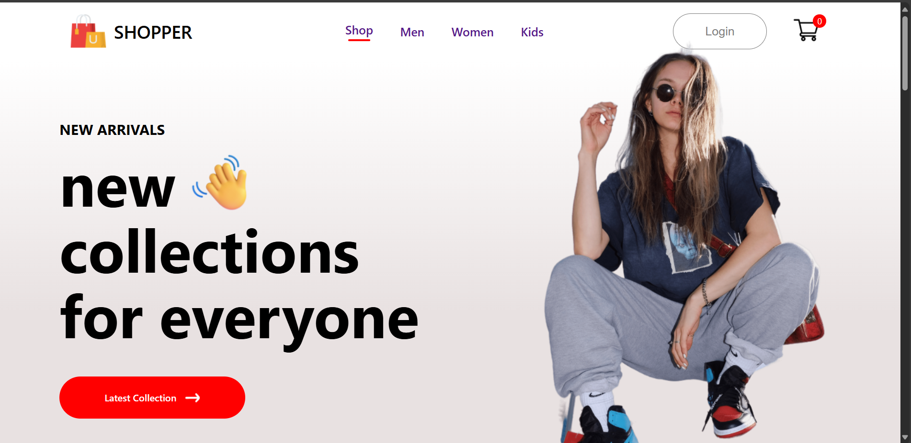
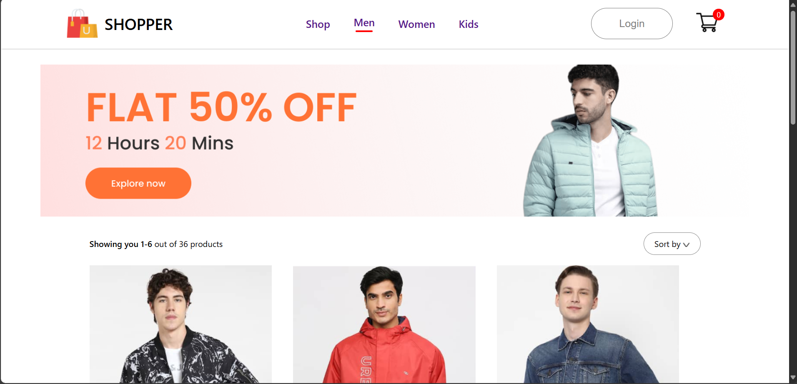
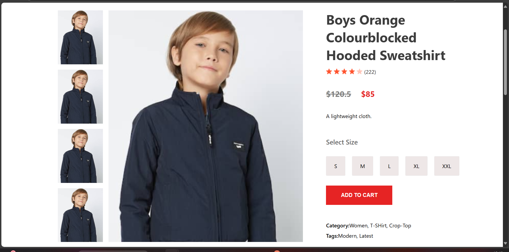
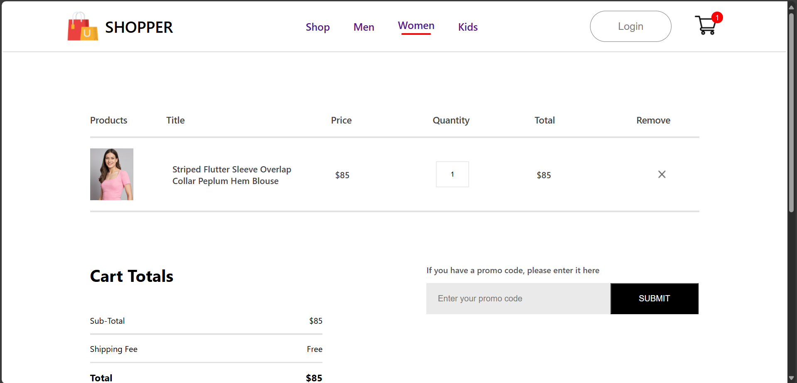

# 🛍️ React JS eCommerce Website

This project is a fully functional **eCommerce website built using React JS**, designed for users to browse, explore, and add products to their shopping cart. The application showcases a clean and modern UI with a responsive layout. It includes a **homepage with featured sections like Trending Products, Offer Banners, and a Newsletter Signup**, as well as **dedicated category pages** for Men's, Women's, and Kids' products.

Users can **view detailed product pages, add items to their cart, and proceed to the cart page** to review or remove items. Though this version doesn’t include payment gateway integration, it serves as a complete front-end store setup, and is ideal for learning **React components, props, state, hooks, and context API**.

This project can be used as a **template** or a **starting point** for a more advanced full-stack eCommerce application.

---
## 📁 Folder Structure

```
ecommerce/
├── public/
│   ├── index.html
│   ├── favicon.ico
│   ├── logo192.png
│   ├── logo512.png
│   └── manifest.json
├── src/
│   ├── Components/
│   │   ├── Assets/
│   │   ├── Breadcrumbs/
│   │   ├── CartItems/
│   │   ├── DescriptionBox/
│   │   ├── Footer/
│   │   ├── Hero/
│   │   ├── Item/
│   │   ├── Navbar/
│   │   ├── NewCollections/
│   │   ├── NewsLetter/
│   │   ├── Offers/
│   │   ├── Popular/
│   │   ├── ProductDisplay/
│   │   └── RelatedProducts/
│   ├── Context/
│   │   └── ShopContext.jsx
│   ├── Pages/
│   │   ├── CSS/
│   │   │   ├── LoginSignup.css
│   │   │   └── ShopCategory.css
│   │   ├── Cart.jsx
│   │   ├── LoginSignup.jsx
│   │   ├── Product.jsx
│   │   ├── Shop.jsx
│   │   └── ShopCategory.jsx
│   ├── App.css
│   ├── App.js
│   ├── App.test.js
│   ├── index.css
│   ├── index.js
│   ├── logo.svg
│   ├── reportWebVitals.js
│   └── setupTests.js
├── .gitignore
├── package.json
├── package-lock.json
└── README.md
```

---

## 🧰 Tech Stack

- **React JS**
- **JavaScript (ES6)**
- **HTML5 & CSS3**
- **React Context API** for global state management
- **VS Code** for development

---

## 📸 Screenshots









## ✨ Features

✅ Home Page with:
- Trending Products
- Offer Banners
- Newsletter Subscription

✅ Product Pages:
- Men's Category
- Women's Category
- Kids Category

✅ Cart Functionality:
- Add to Cart
- View Cart Items
- Remove from Cart

✅ Authentication UI:
- Login / Signup pages (UI only)

✅ Responsive Design

---

